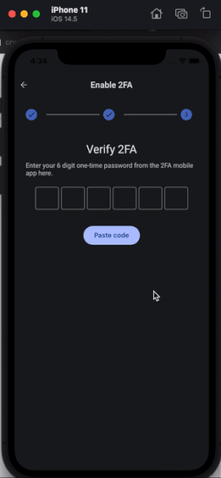
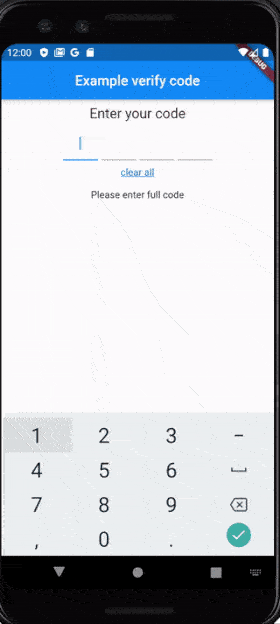

# flutter_verification_code [](https://pub.dev/packages/flutter_verification_code)

- A Flutter package that help you create a verification input.

- Based on https://github.com/tiny-express/flutter_verification_code_input.

- Added state change in case user delete char after complete fill, take a look an example on [Stackoverflow](https://stackoverflow.com/questions/59005381/how-to-know-when-user-delete-the-input-in-verificationcodeinput-flutter/59006077#59006077)

- With version 1.1.0 supports copy/paste of entire code

After install, in your Dart code, you can use:

```dart
import 'package:flutter_verification_code/flutter_verification_code.dart';
```

## Usage

```dart
  VerificationCode(
    textStyle: TextStyle(fontSize: 20.0, color: Colors.red[900]),
    keyboardType: TextInputType.number,
    underlineColor: Colors.amber, // If this is null it will use primaryColor: Colors.red from Theme
    length: 4,
    cursorColor: Colors.blue, // If this is null it will default to the ambient
    // clearAll is NOT required, you can delete it
    // takes any widget, so you can implement your design
    clearAll: Padding(
      padding: const EdgeInsets.all(8.0),
      child: Text(
        'clear all',
        style: TextStyle(fontSize: 14.0, decoration: TextDecoration.underline, color: Colors.blue[700]),
      ),
    ),
    onCompleted: (String value) {
      setState(() {
        _code = value;
      });
    },
    onEditing: (bool value) {
      setState(() {
        _onEditing = value;
      });
      if (!_onEditing) FocusScope.of(context).unfocus();
    },
  ),
```

```dart
onEditing: (bool value) {
  setState(() {
    _onEditing = value;
  });
},
```

```dart
Center(
  child: (_onEditing != true)
      ? Text('Your code: $_code')
      : Text('Please enter full code'),
),
```

## How to use feature with pasting a code
The example is here https://github.com/awaik/flutter_verification_code/issues/23

Full example is here https://github.com/awaik/flutter_verification_code/tree/master/example

## Showcase





## Credits

This is a project by [Agoradesk](https://agoradesk.com/), P2P cryptocurrency trading platform.
Created by the team behind LocalMonero, the biggest and most trusted Monero P2P trading platform.


