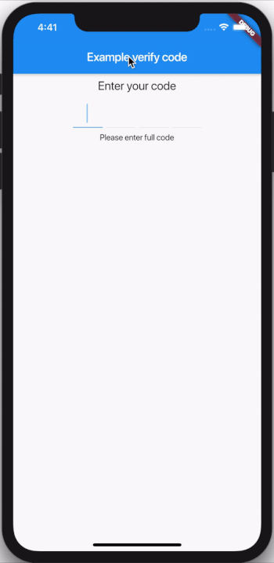

# flutter_verification_code_input

- A Flutter package that help you create a verification input.

- Based on https://github.com/tiny-express/flutter_verification_code_input.

- Added state change in case user delete char after complete fill, take a look an example on [Stackoverflow](https://stackoverflow.com/questions/59005381/how-to-know-when-user-delete-the-input-in-verificationcodeinput-flutter/59006077#59006077)

## Installing

```yaml
  flutter_verification_code:
    git:
      url: https://github.com/awaik/flutter_verification_code.git
    version: ^0.1.3
```

```dart
import 'flutter_verification_code.dart';
```

## Usage

```dart
  VerificationCode(
      keyboardType: TextInputType.number,
      length: 4,
      autofocus: true,
      onCompleted: (String value) {
        //...
        print(value);
      },
  )
```

## Showcase





